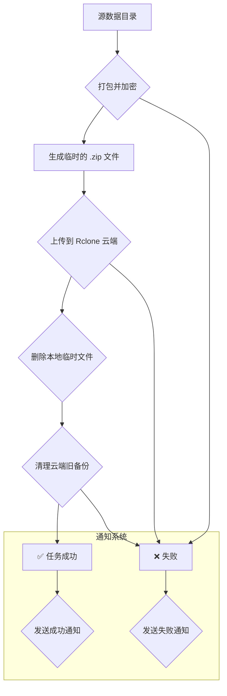

# 🛡️ Universal Backup & Notification Script


一个功能强大、配置灵活的通用数据备份脚本。它能自动完成数据打包、加密、上传到云存储，并能通过企业微信、钉钉、飞书、Telegram 等多种渠道发送丰富的状态通知。

---

## 📚 目录

- [✨ 主要功能](#-主要功能)
- [🗺️ 工作流程](#️-工作流程)
- [🚀 快速开始](#-快速开始)
- [🛠️ 配置指南](#️-配置指南)
  - [变量详解](#变量详解)
- [⚙️ 使用方法](#️-使用方法)
  - [1. 赋予执行权限](#1-赋予执行权限)
  - [2. 设置加密密码 (安全警告)](#2-设置加密密码-安全警告)
  - [3. 手动执行与测试](#3-手动执行与测试)
  - [4. 设置定时任务 (Cron)](#4-设置定时任务-cron)
- [📦 通知格式详解 (Payloads)](#-通知格式详解-payloads)
- [📋 依赖组件](#-依赖组件)
- [📄 许可](#-许可)
- [注意事项](#-注意事项)

---

## ✨ 主要功能

-   📂 **自动化备份**: 自动打包指定目录。
-   🔐 **强制加密**: 使用 `zip` 的内置加密功能保护备份文件安全。
-   ☁️ **云端同步**: 无缝集成 [Rclone](https://rclone.org/)，支持将备份上传到任何 Rclone 支持的云存储服务（如 S3, Google Drive, R2 等）。
-   ♻️ **智能远程清理**: 自动删除云端的旧备份，仅保留**指定数量**的最新版本。
-   📢 **多渠道通知**: 原生支持企业微信、钉钉、飞书、Telegram 和通用 Webhook，发送格式精美的成功或失败通知。
-   -   **强大的错误处理**: 记录详细的失败原因，并在失败时立即退出。

## 🗺️ 工作流程

脚本的执行流程清晰明了，如下所示：


---

## 🚀 快速开始

您可以使用 `wget` 或 `curl` 下载此脚本。推荐将其重命名为 `backup.sh` 以方便管理。

#### 使用 `wget`

```sh
wget -O backup.sh https://raw.githubusercontent.com/nodeloc666/rclone-backup-script/refs/heads/main/backup.sh
```

#### 使用 `curl`

```sh
curl -L -o backup.sh https://raw.githubusercontent.com/nodeloc666/rclone-backup-script/refs/heads/main/backup.sh
```
---

## 🛠️ 配置指南

下载脚本后，使用你喜欢的文本编辑器（如 `vim` 或 `nano`）打开 `backup.sh` 文件，然后修改 `User Configuration Section` 部分的变量。

> **重要**: 在开始前，请确保您已经通过 `rclone config` 命令正确配置了 Rclone，以便 `RCLONE_TARGET` 中的远程仓库名称有效。

### 变量详解

| 变量名                      | 描述                                                                                                      | 示例值                                                    |
| --------------------------- | --------------------------------------------------------------------------------------------------------- | --------------------------------------------------------- |
| `PROJECT_NAME`              | 你的项目名称，将用于命名和通知。                                                                          | `"MyWebApp"`                                              |
| `SOURCE_DIR`                | 需要备份的源目录的绝对路径。                                                                              | `"/var/www/mywebapp"`                                     |
| `LOG_FILE`                  | 脚本执行日志的存放路径。                                                                            | `"/var/log/mywebapp_backup.log"`                          |
| `TEMP_BACKUP_DIR`           | 存放临时生成的 `.zip` 备份文件的目录。                                                                    | `"/var/backups"`                                          |
| `RCLONE_TARGET`             | Rclone 的目标路径，格式为 `RemoteName:path/to/dir`。                                                      | `"S3:/my-backups/webapp"`                                 |
| `BACKUP_RETENTION_COUNT`    | 在云端保留的最新备份文件数量。                                                                            | `5`                                                       |
| `KEEP_LOCAL_BACKUP`         | 是否在上传成功后保留本地的 `.zip` 文件。                                                                  | `"false"`                                                 |
| `NOTIFICATION_MODE`         | 通知模式：`all`, `failure`, `success`, `none`。                                                           | `"failure"`                                               |
| `NOTIFICATION_PROVIDER`     | 通知服务商：`wecom`, `dingtalk`, `feishu`, `telegram`, `generic`, `none`。                                 | `"wecom"`                                                 |
| `WEBHOOK_URL`               | 你的机器人 Webhook URL 或 Telegram Bot API 地址。                                                         | `"https://qyapi.weixin.qq.com/cgi-bin/webhook/send?key=..."` |
| `TELEGRAM_CHAT_ID`          | **仅当** `NOTIFICATION_PROVIDER` 为 `"telegram"` 时需要。                                                   | `"-100123456789"`                                         |

---

## ⚙️ 使用方法

### 1. 赋予执行权限

下载脚本后，首先需要给它添加执行权限。

```sh
chmod +x backup.sh
```

### 2. 设置加密密码 (安全警告)

脚本通过读取环境变量 `ENCRYPTION_PASSWORD` 来获取加密密码。

在终端中设置环境变量：

```sh
export ENCRYPTION_PASSWORD="Your-Super-Secret-Password-Here-123!"
```

### 3. 手动执行与测试

在配置好并设置了密码后，可以直接运行脚本进行一次手动备份测试。

```sh
./backup.sh
```

完成后，检查日志文件 (`LOG_FILE` 中配置的路径) 和你的通知渠道，确保一切工作正常。

### 4. 设置定时任务 (Cron)

使用 `cron` 实现自动化定时备份是最终目的。

1.  打开你的 crontab 编辑器：
    ```sh
    crontab -e
    ```

2.  在文件末尾添加一行来定义定时任务。将环境变量的定义和命令放在同一行是推荐的做法。

    **示例**: 每天凌晨 3:00 执行备份
    ```crontab
    # Backup for MyWebApp project
    0 3 * * * ENCRYPTION_PASSWORD="Your-Super-Secret-Password-Here-123!" /path/to/your/backup.sh
    ```
    > 别忘了将 `/path/to/your/backup.sh` 替换为脚本的 **绝对路径**。

---

## 📦 通知格式详解 (Payloads)

了解脚本发送的 JSON 格式有助于你进行调试或与自定义服务集成。点击下方可展开查看各渠道的格式。

<details>
<summary><strong>企业微信 (wecom)</strong></summary>

使用 `markdown` 类型，支持颜色和格式化。

```json
{
  "msgtype": "markdown",
  "markdown": {
    "content": "### {项目名} Backup Notification\n> **Project:** `{项目名}`\n> **Server:** `{服务器名}`\n> **Status:** <font color=\"{颜色}\">{状态}</font>\n> **Message:** {具体消息}"
  }
}
```
</details>

<details>
<summary><strong>钉钉 (dingtalk)</strong></summary>

使用 `markdown` 类型。**注意**: 请在钉钉机器人安全设置中添加关键词 `Backup`。

```json
{
  "msgtype": "markdown",
  "markdown": {
    "title": "Backup Notification: {项目名} {状态}",
    "text": "### {标题}\n\n**Server:** {服务器名}\n\n**Status:** <font color='{颜色}'>{状态}</font>\n\n**Details:** {具体消息}"
  }
}
```
</details>

<details>
<summary><strong>飞书 (feishu)</strong></summary>

使用简单的 `text` 类型，兼容性最好。

```json
{
  "msg_type": "text",
  "content": {
    "text": "【{表情} Backup Notification】\nProject: {项目名}\nServer: {服务器名}\nStatus: {状态}\nMessage: {具体消息}"
  }
}
```
</details>

<details>
<summary><strong>Telegram (telegram)</strong></summary>

不使用 JSON Body，而是通过 **HTTP GET 请求的 URL 参数** 发送。

-   **URL 格式**: `https://api.telegram.org/bot<TOKEN>/sendMessage?chat_id=<ID>&parse_mode=Markdown&text=<URL编码后的文本>`
-   **消息文本格式 (Markdown)**:
    ```
    *{表情} Backup Notification* ({项目名})

    *Host:* `{服务器名}`
    *Status:* *{状态}*
    *Message:* {具体消息}
    ```
</details>

<details>
<summary><strong>通用 Webhook (generic)</strong></summary>

一个简单、扁平的 JSON 结构，易于任何后端服务解析。

```json
{
  "project": "{项目名}",
  "server": "{服务器名}",
  "status": "{状态}",
  "message": "{具体消息}"
}
```
</details>

---

## 📋 依赖组件

请确保你的系统上安装了以下命令行工具：

-   `zip`: 用于打包和加密。
-   `rclone`: 用于与云存储同步。
-   `curl`: 用于发送 Webhook 通知。

---
## 注意事项
1. 仅测试了**企业微信bot**和一般**通用webhook**，可以正常通知，其他的未测试，**不一定能正常使用**。
2. webhook可以使用[moepush](https://github.com/beilunyang/moepush),cloudflare部署，支持广泛，实用性强。
3. 有bug可以提issue，不过我不一定会修（除非bug比较大），把脚本喂给AI比我来得快。
4. 脚本无法做到绝对的安全，有任何安全问题概不负责！
5. 通知格式有点丑，懒得去美化了，反正能用就行。
6. 设置了远程版本控制（自己设置的文件数），但不知道能否保证同目录下其他文件安全，所以建议一个项目一个文件夹，安全些。
7. 设置本地保存，好像没有对应的版本删除，可能得手动删除本地文件。（Gemini key用完了，明天再修吧）
## 📄 许可

此项目根据 [MIT License](LICENSE) 授权。
