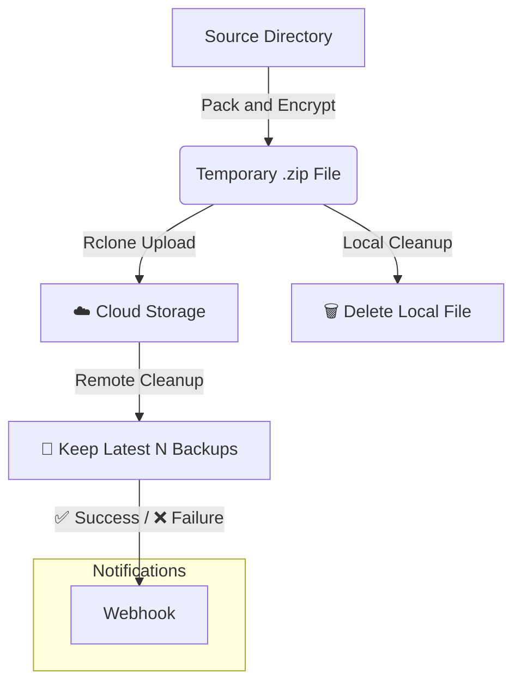

# Robust Shell Script for Automated Backups

[](https://opensource.org/licenses/MIT)

一款通用且强大的 Bash 脚本，专为自动化数据备份、加密和云端同步而设计。无论是个人项目还是服务器数据，它都能提供可靠的、一劳永逸的备份解决方案。

## 流程图 (Workflow)



## 🌟 功能特性 (Features)

-   **📦 自动打包加密**: 将源目录打包为带密码的 `.zip` 文件，确保数据安全。
-   **☁️ 无缝云端同步**: 集成 [Rclone](https://rclone.org/)，支持 S3, Google Drive, R2, Dropbox 等上百种云存储。
-   **🔄 智能版本保留**: 自动清理云端的旧备份，仅保留指定数量的最新版本。
-   **🔔 灵活消息通知**: 通过 Webhook 发送成功或失败的通知，支持四种通知模式 (`all`, `failure`, `success`, `none`)。
-   **📝 详尽日志记录**: 记录完整的执行过程，包括时间戳、步骤和错误信息，便于追踪和排错。
-   **🛡️ 强大的错误处理**: 任何关键步骤失败都会安全退出，并通过通知和日志报告具体原因。
-   **✅ 依赖自动检查**: 启动时检查 `zip`, `rclone`, `curl` 是否已安装。

## 🔧 环境要求 (Prerequisites)

-   **Bash**: 脚本运行环境。
-   `zip`: 用于压缩与加密。
-   `rclone`: 用于与云存储同步。 (需要预先通过 `rclone config` 配置好)
-   `curl`: 用于发送 Webhook 通知。

## 🚀 安装与设置 (Installation & Setup)

#### 1. 下载脚本

在你的服务器上，使用 `curl` 或 `wget` 下载脚本。

```bash
# 使用 curl
curl -L -o backup.sh "https://raw.githubusercontent.com/YOUR_USERNAME/YOUR_REPOSITORY/main/backup.sh"
```
```bash
# 或者使用 wget
wget -O backup.sh "https://raw.githubusercontent.com/nodeloc666/rclone-backup-script/main/backup.sh"
```

#### 2. 授予执行权限

```bash
chmod +x backup.sh
```

## ⚙️ 配置详解 (Configuration)

打开 `backup.sh` 并修改文件头部的 **User Configuration Section**。

| 变量 (Variable) | 描述 (Description) | 示例值 (Example Value) |
| :--- | :--- | :--- |
| `PROJECT_NAME` | 项目的简称。用于命名备份文件和日志。| `"MyWebApp"` |
| `SOURCE_DIR` | **需要备份的源目录的绝对路径。** | `"/var/www/my-app"` |
| `LOG_FILE` | 日志文件的存储位置。| `"/var/log/mywebapp_backup.log"` |
| `TEMP_BACKUP_DIR` | 存放临时 `.zip` 备份文件的目录。| `"/var/backups"` |
| `RCLONE_TARGET` | Rclone 的远程目标路径 (`RemoteName:Path`)。| `"S3_Bucket:/backups/my-app"` |
| `BACKUP_RETENTION_COUNT`| 在云端保留的最新备份文件数量。| `7` |
| `KEEP_LOCAL_BACKUP` | 上传成功后是否保留本地的 `.zip` 文件。| `"false"` |
| `NOTIFICATION_MODE` | 通知模式：`all`, `failure`, `success`, `none`。| `"failure"` |
| `WEBHOOK_URL` | 用于接收通知的 Webhook URL。| `"https://gotify.example.com/message/..."` |

---

### 🔒 加密密码 (Encryption Password)

**为了安全，请勿将密码硬编码在脚本中。**
此脚本从环境变量 `ENCRYPTION_PASSWORD` 读取加密密码。在运行脚本前，请先设置它：

```bash
export ENCRYPTION_PASSWORD="your-super-strong-and-secret-password"
```

## ▶️ 如何使用 (Usage)

### 手动执行 (用于测试)

在第一次配置完成后，建议手动执行一次以确保一切正常。

```bash
# 1. 在当前终端会话中设置密码
export ENCRYPTION_PASSWORD="your-strong-password"

# 2. 运行脚本
./backup.sh

# 3. 实时查看日志输出，检查是否有错误
tail -f /var/log/mywebapp_backup.log
```

### 🗓️ 自动执行 (使用 Cron)

使用 `cron` 来设置定时自动备份，这是推荐的生产环境用法。

1.  打开 `crontab` 编辑器：
    ```bash
    crontab -e
    ```

2.  在文件末尾添加一行。**重要提示**: Cron 任务的环境变量是隔离的，所以必须在命令前直接定义密码。

    ```crontab
    # 每天凌晨 3:00 执行 MyWebApp 的备份任务
    0 3 * * * ENCRYPTION_PASSWORD="your-strong-password" /path/to/your/backup.sh
    ```
    > **请务必**:
    > - 将 `your-strong-password` 替换为你的真实密码。
    > - 将 `/path/to/your/backup.sh` 替换为你脚本的实际绝对路径。

## 📄 许可证 (License)

本项目采用 [MIT License](./LICENSE) 授权。
